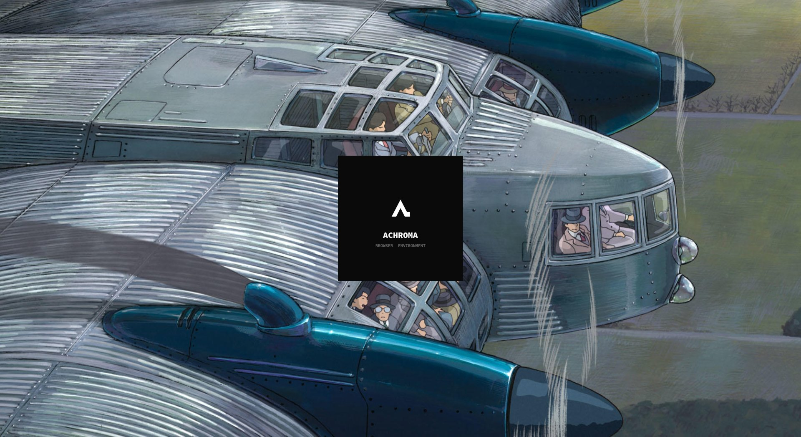
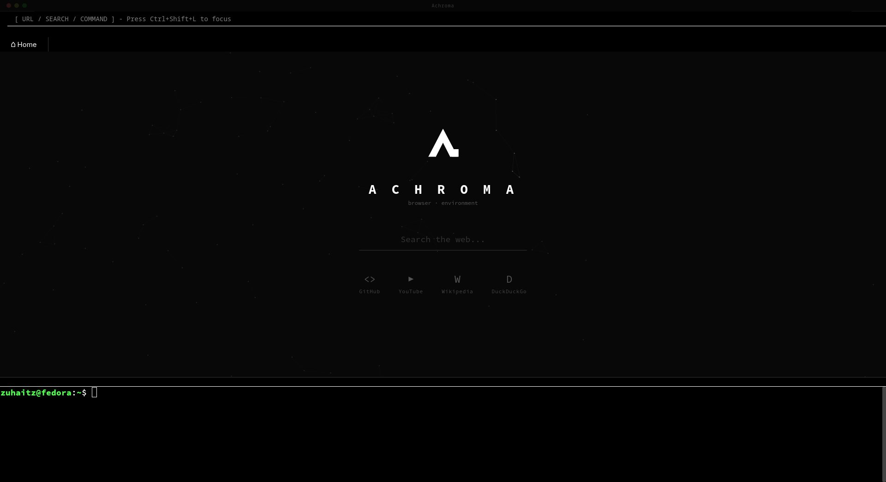
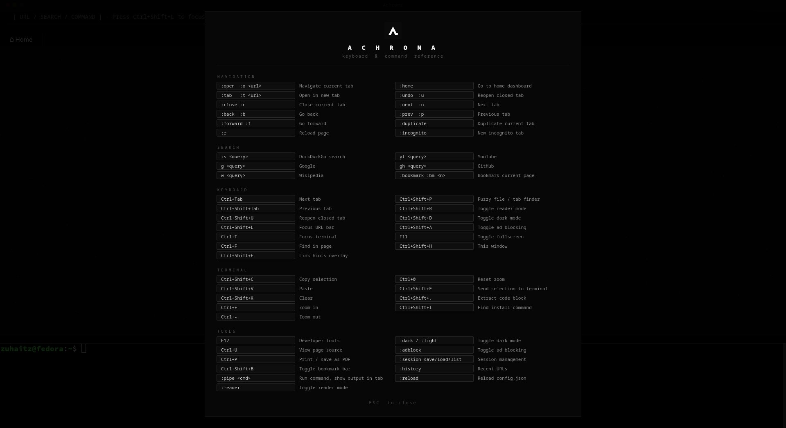
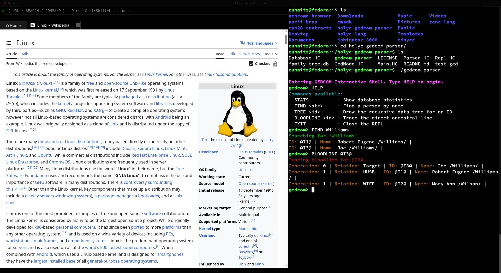

<p align="center">
  
</p>

<h1 align="center">Achroma</h1>
<p align="center"><i>keyboard-driven browser + terminal</i></p>

<p align="center">
  
  <a href="https://github.com/Zuhaitz-dev/achroma/actions"></a>
  
  
</p>

---

## Quick Start

```bash
# Fedora
dnf install qt6-qtbase-devel qt6-qtwebengine-devel qtermwidget-devel cmake gcc-c++

# Ubuntu (qtermwidget6 must be built from source)
apt install qt6-base-dev qt6-webengine-dev cmake g++ git libutf8proc-dev liblz4-dev
git clone --depth 1 https://github.com/lxqt/qtermwidget.git /tmp/qtermwidget
cmake -B /tmp/qtermwidget/build -S /tmp/qtermwidget -DCMAKE_BUILD_TYPE=Release -DCMAKE_INSTALL_PREFIX=/usr -DQTERMWIDGET_USE_UTEMPTER=OFF
sudo cmake --build /tmp/qtermwidget/build --target install -j$(nproc)

# Build
cmake -B build -DCMAKE_BUILD_TYPE=Release
make -C build -j$(nproc)
./build/Achroma
```

---

## Screenshots

<p align="center">
  &nbsp;
  
  <br>
  &nbsp;
  
</p>

---

## Features

| | |
|---|---|
| Tabbed browsing | Sessions, pinning, reopen closed, tooltips, middle-click close |
| Integrated terminal | Real-time output triggers, zoom, search, profile switching |
| Vim keys | `j` `k` `d` `u` `G` `gg` scrolling, link hints (Vimium-style) |
| Command system | `:open`, `:tab`, `:search`, `:hint`, `:bookmark`, `:session`, and more |
| Fuzzy finder | `Ctrl+Shift+P` filer: files, tabs, bookmarks, history, commands |
| Ad blocking | EasyList-style domain blocklist (`~/.config/achroma/blocklist.txt`) |
| IPC control | Unix socket, `achroma-cli` from any terminal |
| Configurable | Colors, fonts, keybindings, search engines, CSS themes |

---

## Install

### System-wide

```bash
./scripts/install.sh
```

Installs to `/usr/local/bin`. After install:

```bash
achroma
achroma-cli tabs
```

### Uninstall

```bash
./scripts/install.sh --uninstall
```

### AppImage

```bash
./scripts/build-appimage.sh                     # builds AppDir
wget https://github.com/linuxdeploy/linuxdeploy/releases/download/continuous/linuxdeploy-x86_64.AppImage
chmod +x linuxdeploy-x86_64.AppImage
./linuxdeploy-x86_64.AppImage --appdir build/appimage/AppDir --output appimage
```

---

## Configuration

`~/.config/achroma/config.json`:

```json
{
  "appearance": {
    "bg": "#000000",
    "fg": "#FFFFFF",
    "font_family": "Source Code Pro",
    "font_size": 18,
    "dark_mode": false,
    "qss_file": "theme.qss"
  },
  "engines": {
    "so": "https://stackoverflow.com/search?q="
  },
  "commands": {
    "docs": { "action": "search", "engine": "https://devdocs.io/search?q={{arg}}" }
  },
  "triggers": [
    {
      "pattern": "error: (.*)",
      "action": "search",
      "engine": "https://duckduckgo.com/?q={{match}}"
    }
  ],
  "keys": {
    "focus_terminal": "Ctrl+T",
    "fuzzy_finder": "Ctrl+Shift+P"
  },
  "dev": {
    "editor": "nvim",
    "search_dirs": ["~/projects", "~/src"],
    "runners": {
      "py": "python3 {file}",
      "rs": "rustc {file} -o /tmp/out && /tmp/out"
    }
  }
}
```

Hot-reloaded on save, no restart needed.

---

## Commands

Type `:command` in the URL bar, or prefix with `:` in the terminal.

### Navigation

| Command | Description |
|---|---|
| `open` / `o <url>` | Navigate current tab |
| `tab` / `t <url>` | Open in new tab |
| `back` / `b` | Go back |
| `forward` / `f` | Go forward |
| `r` | Reload page |
| `g <n>` | Switch to tab n |
| `close` / `c` | Close current tab |
| `undo` / `u` | Reopen closed tab |
| `next` / `n` | Next tab |
| `prev` / `p` | Previous tab |
| `home` | Dashboard |
| `duplicate` | Duplicate tab |
| `incognito` | New incognito tab |

### Search

| Command | Engine |
|---|---|
| `s <query>` | DuckDuckGo |
| `g <query>` | Google |
| `w <query>` | Wikipedia |
| `yt <query>` | YouTube |
| `gh <query>` | GitHub |
| `ddg <query>` | DuckDuckGo |

### Dev & Tools

| Command | Description |
|---|---|
| `man <name>` | Linux man pages |
| `tldr <name>` | TL;DR pages |
| `docs <lang> <term>` | Language docs lookup |
| `run` | Execute snippet from `/tmp/achroma-snippet.*` |
| `pipe <cmd>` | Run shell command, output in tab |
| `issues` / `prs` | GitHub issues/PRs on current repo |
| `blame` | Git blame view |
| `permalink` | Copy GitHub permalink |
| `codeblock` | Extract code block from page |
| `install` | Find install command on page |
| `notes` | Quick scratchpad |
| `session save/load <name>` | Named session management |

### Terminal

| Command | Description |
|---|---|
| `clear` | Clear terminal |
| `copy` / `paste` | Clipboard |
| `profile <name>` | Switch color scheme |
| `sterm` | Toggle search bar |

---

## Shortcuts

| Key | Action |
|---|---|
| `Ctrl+T` | Focus terminal |
| `Ctrl+Shift+L` | Focus URL bar |
| `Ctrl+O` | Toggle split orientation |
| `Ctrl+Return` | Open URL bar content in new tab |
| `Ctrl+1`-`9` | Switch to tab 1-9 |
| `Ctrl+Shift+1`-`9` | Switch to tab 1-9 |
| `Ctrl+Tab` / `Ctrl+Shift+Tab` | Next / previous tab |
| `Ctrl+Shift+U` | Reopen closed tab |
| `Ctrl+Shift+T` | Copy page selection to terminal |
| `Ctrl+Shift+E` | Send selection to terminal |
| `Ctrl+Shift+.` | Extract code block from page |
| `Ctrl+Shift+I` | Find install command on page |
| `Ctrl+F` | Find in page |
| `Ctrl+Shift+F` | Link hints |
| `Ctrl+Shift+P` | Fuzzy finder |
| `Ctrl+Shift+H` | Help overlay |
| `Escape` | Close overlay / find bar |
| `F12` | Developer tools |
| `F11` | Fullscreen |
| `Ctrl+Shift+D` | Toggle dark mode |
| `Ctrl+Shift+A` | Toggle ad blocking |
| `Ctrl+Shift+R` | Toggle reader mode |
| `Ctrl+U` | View page source |
| `Ctrl+P` | Print / save as PDF |
| `Ctrl+Shift+B` | Toggle bookmark bar |
| `Ctrl+Shift+C` / `V` | Terminal copy / paste |
| `Ctrl+Shift+K` | Clear terminal |
| `Ctrl++` / `-` / `0` | Terminal zoom |

All shortcuts configurable under `keys` in `config.json`.

---

## Triggers

Terminal output is watched for patterns. Defaults:

| Pattern | Action |
|---|---|
| `error:` / `fatal error:` | DuckDuckGo search |
| `undefined reference to` | DuckDuckGo search |
| `https://…` URLs | Open in browser |
| `file.cpp:45:10:` | Open in editor |

Debounced at 2 seconds to avoid flooding. Add custom triggers in `config.json`:

```json
{
  "triggers": [
    {
      "pattern": "warning: (.*)",
      "action": "search",
      "engine": "https://duckduckgo.com/?q=gcc+warning+{{match}}"
    },
    {
      "pattern": "([^\\s:]+):(\\d+):\\d*:?",
      "action": "external",
      "command": "nvim +{{2}} {{1}}"
    }
  ]
}
```

---

## CLI

```bash
achroma-cli open https://github.com
achroma-cli tab https://news.ycombinator.com
achroma-cli search "qt error handling"
achroma-cli tabs
achroma-cli execute "help"
```

---

## Development

### Build presets

```bash
cmake --preset release   # optimized, no tests
cmake --preset debug     # debug symbols + tests
cmake --preset asan      # AddressSanitizer
cmake --preset ubsan     # UndefinedBehaviorSanitizer
cmake --preset sanitize  # ASan + UBSan combined

make -C build/<preset> -j$(nproc)
```

### Tests

```bash
cmake -B build -DBUILD_TESTS=ON
make -C build -j$(nproc)
ctest --test-dir build

# Offscreen (CI)
QT_QPA_PLATFORM=offscreen ctest --test-dir build

# Real rendering
xvfb-run -a ctest --test-dir build
```

### Lint

```bash
make -C build lint        # clang-tidy
```

---

## Architecture

```
src/
  browser.h/cpp          Tab management, URL bar, session, autocomplete
  terminal.h/cpp         QTermWidget wrapper, PTY output, zoom
  commands.h/cpp         Command dispatch, config load, search engines
  triggers.h/cpp         Terminal output pattern matching
  fuzzyfinder.h/cpp      Fuzzy file/tab/bookmark/command search
  ipc.h/cpp              Unix socket server for CLI control
  adblockinterceptor.h/cpp  URL request interceptor (EasyList-style)
  splash.h/cpp           Startup splash screen
  window.h/cpp           Main window, layout, shortcuts, help overlay
  utils.h/cpp            URL formatting, ANSI stripping, JS injection

test/
  test.cpp               Utils unit tests
  test_adblock.cpp        Ad blocker tests
  test_commands.cpp       Command dispatch tests
  test_scripts.cpp        JS injection integration tests
```

Built with Qt 6, qtermwidget6, and CMake 3.16+.

---

## License

MIT
